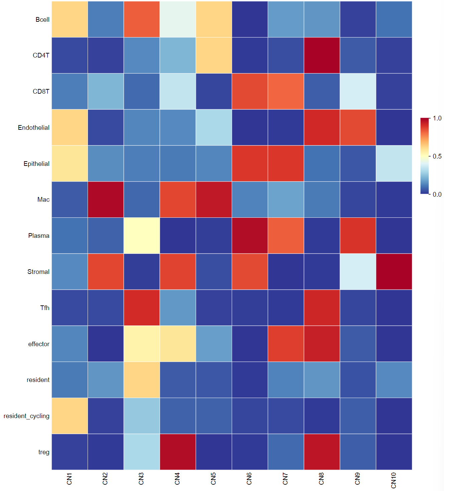
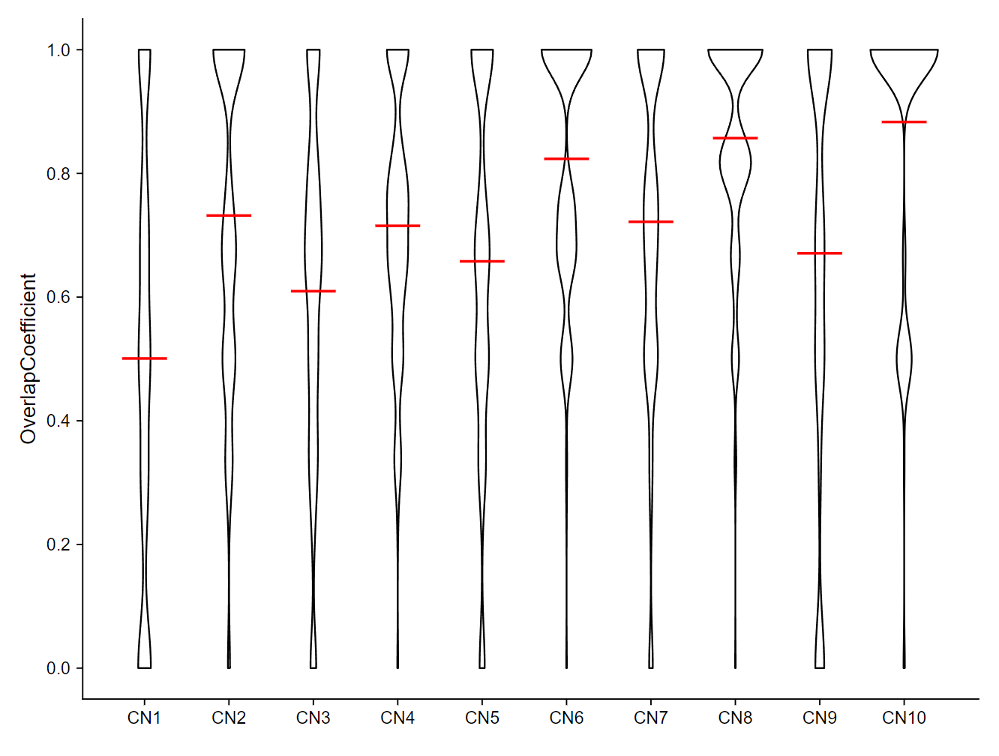
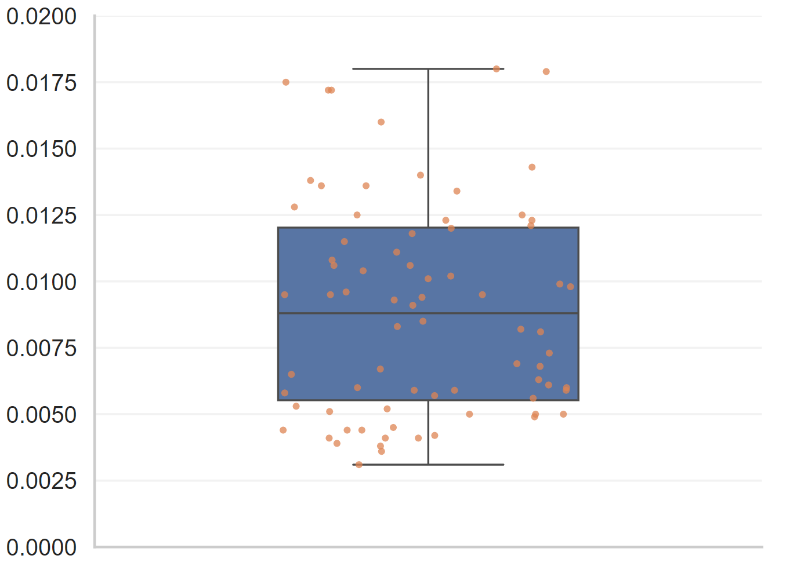
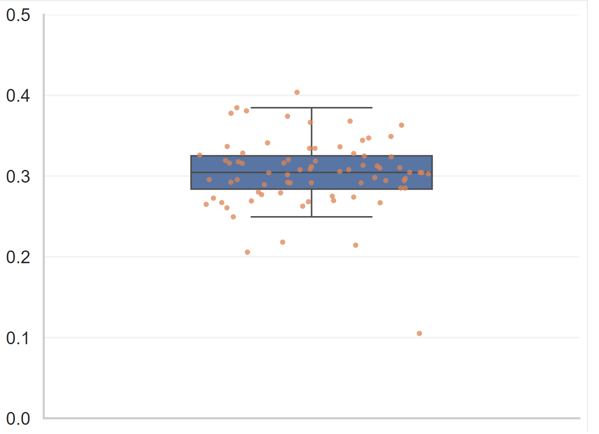
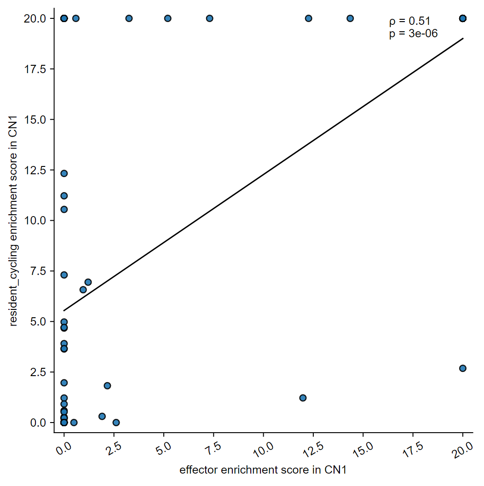
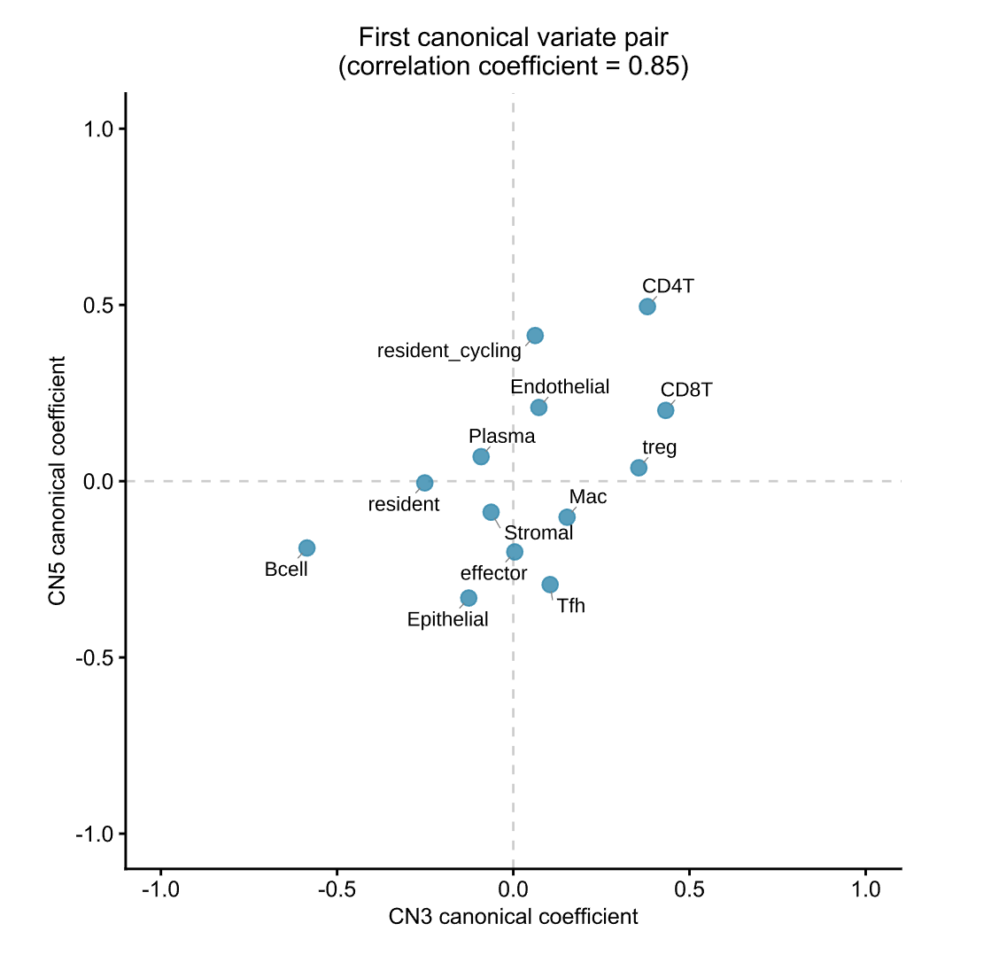
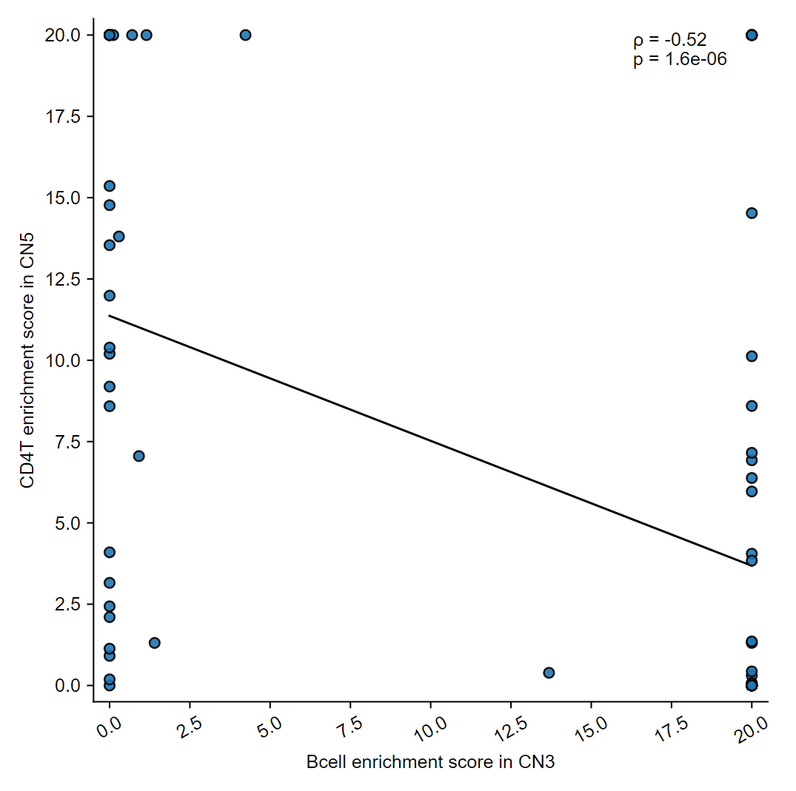
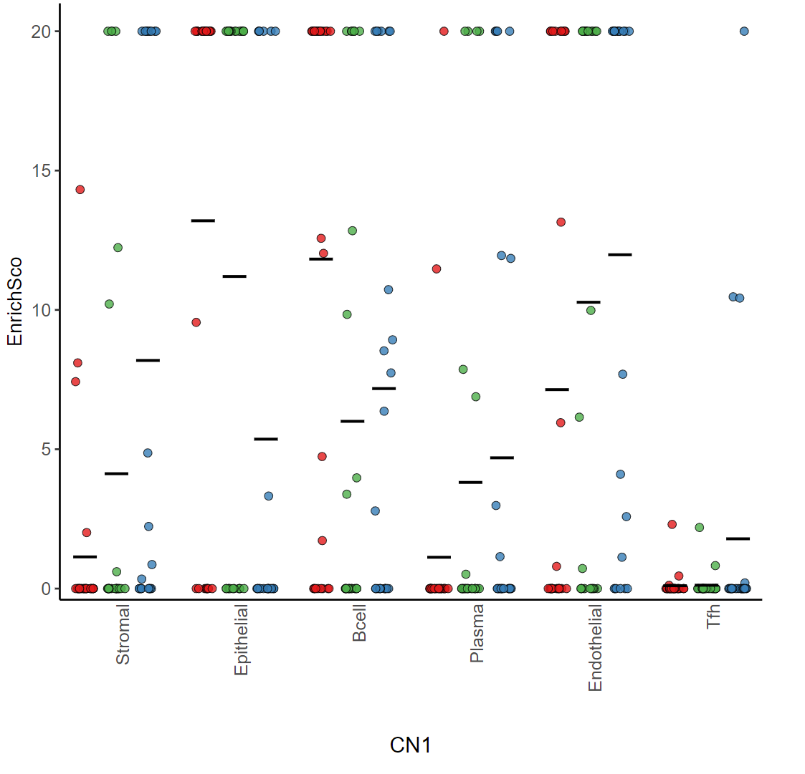
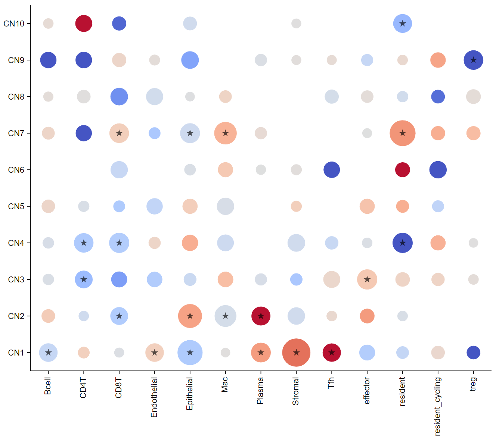

# CytoCommunity2

## Contents

- [Overview](#overview)
- [Installation](#installation)
- [Usage](#usage)
- [Update Log](#update-log)
- [Maintainers](#maintainers)
- [Citation](#citation)


## Overview

To enhance CytoCommunity (https://github.com/huBioinfo/CytoCommunity), we present CytoCommunity2, **a unified weakly-supervised framework** for identifying and comparing tissue cellular neighborhoods (TCNs or CNs) across **large-scale spatial omics samples with single or multiple biological conditions**. 

Inspired by histopathology workflows, CytoCommunity2 first hierarchically partitions the large single-cell spatial map into small patches, performs graph construction and weakly supervised TCN learning for each patch, and finally merges results through KNN-based TCN reassignment at segmentation boundaries to ensure TCN spatial continuity. This strategy divides the original sample into patches for TCN learning, achieving **memory efficiency (typical 24G graphics memory is enough)** and also increased sample throughput. These optimizations significantly **enhance the robustness of TCNs and cross-sample alignment performance**.

Furthermore, to make CytoCommunity2 a unified framework that is also **applicable for single-condition spatial omics datasets**, pseudo-samples with artificial labels are generated, enabling automatic TCN alignment across real samples via **contrastive learning**.

**_In summary, the advantages of CytoCommunity2 include:_**

**_(1) Using significantly less memory for large-scale spatial omics samples with millions of cells._**

**_(2) A unified weakly-supervised model applicable for both multi-condition and single-condition datasets._**

**_(3) High TCN alignment performance makes it well-suited for comparative analysis in large cohort studies._**


## Installation

### Hardware requirement 

(Graphics) Memory: 24G

Storage: 10GB or more

### Software requirement

Conda version: 22.9.0

Python version: 3.10.6

R version: >= 4.0 suggested

Clone this repository and cd into it as below.
```
git clone https://github.com/LiukangWu/CytoCommunity2.git
cd CytoCommunity2
```

### Set up virtual environment for Windows

1. Create a new conda environment using the environment_windows_cpu.yml file (CPU version) and activate it:

    ```bash
    conda env create -f environment_windows_cpu.yml
    conda activate CytoCommunity_cpu
    ```

    Or create a new conda environment using the environment_windows_gpu.yml file (GPU version) and activate it:

    ```bash
    conda env create -f environment_windows_gpu.yml
    conda activate CytoCommunity_gpu
    ```


2. Install the diceR package (R has already been included in the requirements) with the following command:

    ```bash
    R.exe
    > install.packages("diceR")
    ```

### Set up virtual environment for Linux

1. Create a new conda environment using the environment_linux_cpu.yml file (CPU version) and activate it:

    ```bash
    conda env create -f environment_linux_cpu.yml
    conda activate CytoCommunity_cpu
    ```

    Or create a new conda environment using the environment_linux_gpu.yml file (GPU version) and activate it:

    ```bash
    conda env create -f environment_linux_gpu.yml
    conda activate CytoCommunity_gpu
    ```


2. Install R and the diceR package:
    
    ```bash
    conda install R
    R
    > install.packages("diceR")
    ```

The whole installation should take around 20 minutes.


## Usage

### Prepare input data

The input data to CytoCommunity2 includes **four** types of files (refer to "CODEX_SpleenDataset/"): 

**(1)** An image (sample) name list file, named as **"ImageNameList.txt"**.

**(2)** A cell type label file for each image (sample), named as **"[image name]_CellTypeLabel.txt"**. Note that [image_name] should be consistent with your customized image names listed in the "ImageNameList.txt".
This file lists cell type names of all cells in an image (sample).

**(3)** A cell spatial coordinate file for each image (sample), named as **"[image name]_Coordinates.txt"**. Note that [image_name] should be consistent with your customized image names listed in the "ImageNameList.txt".
This file lists cell coordinates (tab-delimited x/y) of all cells in an image (sample). The cell orders should be exactly the same with "[image name]_CellTypeLabel.txt".

**(4)** **(Optional, for multi-condition datasets only)** A graph label file for each image (sample), named as **"[image name]_GraphLabel.txt"**. Note that [image_name] should be consistent with your customized image names listed in the "ImageNameList.txt".
This file contains an integer label (e.g., "0", "1", "2", etc) that indicates the condition of each image (sample) in the weakly-supervised learning framework. !!Must begin with 0.


### Ready to run

#### Step 0: (Optional, for single-condition datasets only) Generate pseudo-spatial maps by shuffling cell types in real spatial maps.

This step generates a folder "Step0_Output" containing pseudo-spatial maps created by randomly shuffling cell type labels while maintaining original spatial coordinates. Each pseudo-sample will have corresponding "pseudo" suffixed files alongside the original samples.

```bash
python Step0_GeneratePseudoMaps.py
```
&ensp;&ensp;**Hyperparameters**
- InputFolderName: The folder name of your original input dataset.


#### Step 1: Construct KNN-based cellular spatial graghs of all patches and convert them to the standard format required by Torch.

This step generates a folder "Step1_Output" including constructed cellular spatial graphs of all patches.

```bash
python Step1_ConstructCellularSpatialGraphs.py
```
&ensp;&ensp;**Hyperparameters**
- KNN_K: The K value (default=50; To identify ≥10 TCNs, a value of 20 is suggested) used in the construction of the K nearest neighbor graph (cellular spatial graph) for each patch.

#### Step 2: Perform soft TCN assignment learning in a weakly-supervised fashion.

This step generates a folder "Step2_Output" containing results from multiple independent runs of the weakly-supervised TCN learning process. Each run folder includes training loss logs and output matrices (cluster assignment matrix, cluster adjacency matrix, and node mask) for all patches. The model combines graph partitioning (MinCut loss) with graph classification (cross-entropy loss) in an end-to-end training framework.

```bash
python Step2_TCN-Learning_WeaklySupervised.py
```
&ensp;&ensp;**Hyperparameters**
- Num_TCN: Maximum number of TCNs (default=4) to identify.
- Num_Run: Number of independent training runs (default=10).
- Num_Epoch: Training epochs per run (default=400).
- Num_Class: Number of tissue image (sample) conditions (default=2).
- Embedding_Dimension: Embedding dimension (default=128).
- MiniBatchSize: This value is commonly set to be powers of 2 due to efficiency consideration (default=2).
- LearningRate: Optimizer learning rate (default=0.001).
- beta: A weight parameter to balance the MinCut loss used for graph partitioning and the cross-entropy loss used for graph classification. The default value is set to [0.9] due to emphasis on graph partitioning.

#### Step 3: Perform TCN assignment ensemble.

The results of this step are saved under the "Step3_Output/ImageCollection/" directory. A "TCNLabel_MajorityVoting.csv" file will be generated for each patch.

```bash
Rscript Step3_CNEnsemble.R
```
&ensp;&ensp;**Hyperparameters**
- NONE

#### Step 4: Generate final visualizations.

This step generates a folder "Step4_Output" containing four subfolders with comprehensive results: "TCN_Plot" storing spatial maps colored by identified TCNs (in PNG and PDF formats), "CellRefinement_Plot" showing boundary refinement results, "ResultTable_File" containing detailed TCN identification results in CSV format, and "CellType_Plot" storing spatial maps colored by original cell type annotations.

```bash
python Step4_Step4_CNVisualization.py
```
&ensp;&ensp;**Hyperparameters**
- KNN_K: Number of nearest neighboring cells (default=50) used for boundary refinement.
- Num_TCN: Maximum number of TCNs (default=4) for consistent coloring.
- Smoothing_range: Spatial range (default=50μm) for boundary refinement.
- InputFolderName: Path to input dataset folder (default="./Step0_Output/"). !!Change it to the original input directory for multi-condition datasets.


### Demo for Downstream Analysis
After obtaining the clustering results in 'Step4_Output', we can proceed with the subsequent downstream analysis. The first step is to calculate the cell-type enrichment scores for each sample
```batch
cd CytoCommunity2
matlab -batch "run('./DownStreamAnalysis/DifferentialComposed_Analysis/Step1_CellTypeEnrichmentMatrix.m')"
```
The enrichment score matrix is the foundation for our downstream analysis, and next, we can start with dominant cell type analysis.
```batch
python DownStreamAnalysis/DominateCT_Analysis/Heatmap_config.py
python DownStreamAnalysis/DominateCT_Analysis/plot.py
```
<p align="center">
  
</p>
Next, we evaluated the reproducibility of the CNs.

```batch
python DownStreamAnalysis/Recurrency_Analysis/OC_config.py
python DownStreamAnalysis/Recurrency_Analysis/plot.py
```
<p align="center">
  
</p>

We next evaluated the coherence of the CNs.
```batch
python DownStreamAnalysis/Coherence_Analysis/Coherence_config.py
python DownStreamAnalysis/Coherence_Analysis/plot.py
```
<div align="center">
<div style="display:flex; justify-content:center; gap:10px;">
<div>
<b>CHAOS score</b><br>

</div>

<div>
<b>PAS score</b><br>

</div>

</div>

</div>

We next investigated cell–cell communication both within and between CNs.

```batch
python DownStreamAnalysis/Communication_Analysis/SpermanWithinCNs_config.py
python DownStreamAnalysis/Communication_Analysis/SpermanWithinCNs_plot.py
```
This is the result of cell–cell communication within CN1.
<p align="center">
  
</p>

Next, we perform canonical correlation analysis (CCA) between CNs.
```batch
Rscript DownStreamAnalysis/Communication_Analysis/CCA_config.R
Rscript DownStreamAnalysis/Communication_Analysis/CCA_plot.R
```
<p align="center">
  
</p>

After obtaining the first canonical correlation pair between CNs, we use it to analyze cell–cell communication between CNs.

```batch
python DownStreamAnalysis/Communication_Analysis/SpermanBetweenCNs_config.py
python DownStreamAnalysis/Communication_Analysis/SpermanBetweenCNs_plot.py
```

This is the result of cell–cell communication between CN6 and CN10.
<p align="center">
  
</p>

Finally, we perform an analysis and visualization of the DCFs.
```batch
python DownStreamAnalysis/DifferentialComposed_Analysis/Step2_test_GraphLabel.py
Rscript DownStreamAnalysis/DifferentialComposed_Analysis/Step3_t_test.R
```

Filter cell types with significant p-values (p < 0.05).
```batch
python DownStreamAnalysis/DifferentialComposed_Analysis/Step4_filterPvalue.py
```
Generate p-value plot per CN
```batch
Rscript DownStreamAnalysis/DifferentialComposed_Analysis/Step5_PvaluePlotperCN.R
```
<p align="center">
  
</p>
Generate dot plot

```batch
python DownStreamAnalysis/DifferentialComposed_Analysis/Pvalue_dotplot.py
```
<p align="center">
  
</p>

## Update Log


## Maintainers
Liukang Wu (yetong@stu.xidian.edu.cn)

Yafei Xu (22031212416@stu.xidian.edu.cn)

Yuxuan Hu (huyuxuan@xidian.edu.cn)


## Citation

Yuxuan Hu, Jiazhen Rong, Yafei Xu, Runzhi Xie, Jacqueline Peng, Lin Gao, Kai Tan. Unsupervised and supervised discovery of tissue cellular neighborhoods from cell phenotypes. **Nature Methods**, 2024, 21:267–278 https://doi.org/10.1038/s41592-023-02124-2

